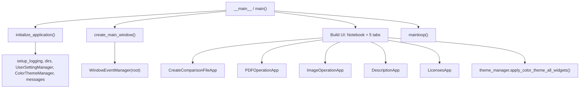
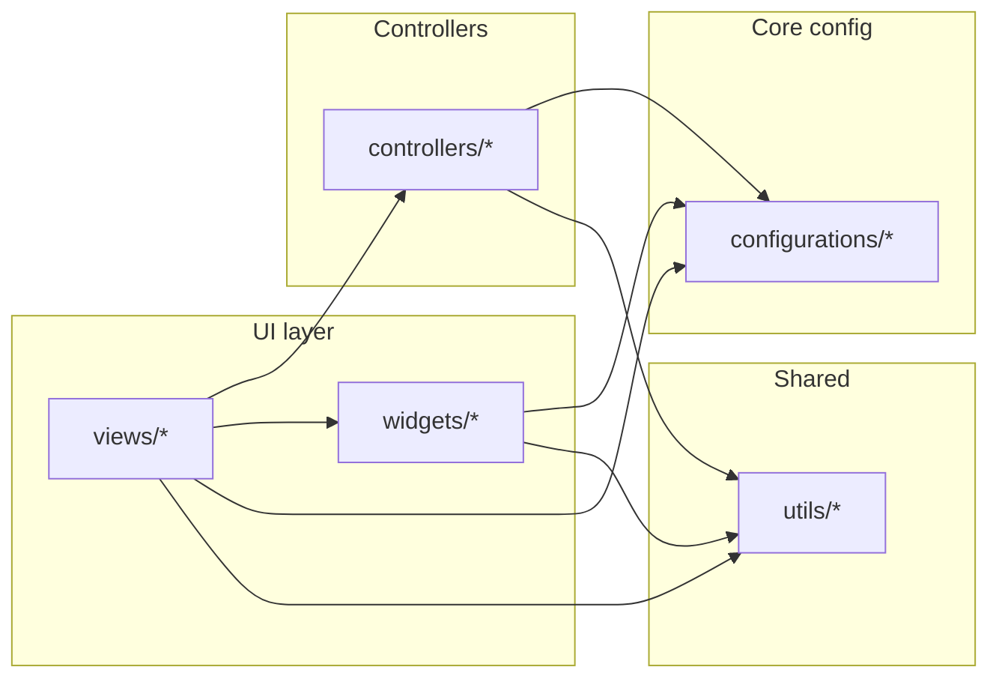
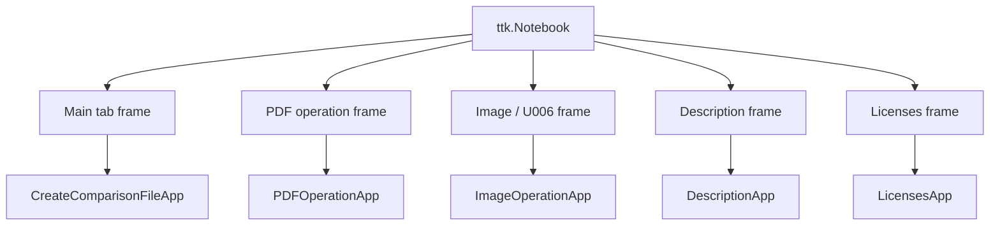
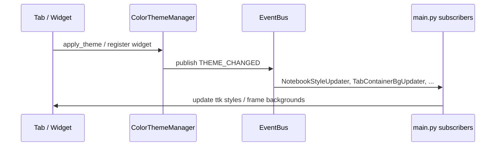

# pdfDiffChecker — Architecture overview

This document summarizes how the desktop application is structured at a **module and control-flow** level. It is not an exhaustive catalog of every class or function.

## Runtime layout

| Area | Role |
|------|------|
| `main.py` | Process entry, `tk.Tk` / `ttk.Notebook`, tab wiring, global theme hooks, window lifecycle |
| `configurations/` | Paths, production vs dev mode, `MessageManager`, user settings persistence |
| `controllers/` | Theme, app state, event bus, PDF/image logic, mouse/keyboard handlers, export, etc. |
| `views/` | Tab UIs: main comparison, PDF tools, image/U006 tools, description, licenses |
| `widgets/` | Reusable Tk widgets (paths, graphs, progress, etc.) |
| `utils/` | Shared helpers (resources, geometry, etc.) |

Production executables (Nuitka / frozen) resolve user data under `%LocalAppData%\pdfDiffChecker\` per `configurations/tool_settings.py`.

## Startup flow (Mermaid)

## Layer dependency (high level)

Dependencies generally flow **inward**: views and controllers may use configurations and utils; configurations should not import views.

## Main window composition

`main.py` constructs one `ttk.Notebook` and adds five container `Frame`s. Each tab body is a view class packed into its frame:

## Cross-cutting: theme and events

- **`ColorThemeManager`** loads JSON from `themes/` and applies colors to registered widgets.
- **`EventBus`** publishes `THEME_CHANGED`; `main.py` subscribes nested helpers (e.g. notebook/tab chrome, ttk style maps) so ttk and classic Tk stay aligned.
- **`MessageManager`** serves UI/log strings from `configurations/message_codes.json` (language-aware).

## Tab change coordination

On `<<NotebookTabChanged>>`, `main.py` calls `_sync_shared_paths_from_settings` on **Main, PDF, and Image** tabs when present, so shared path fields stay coherent across tabs.

## Pointers to deeper behavior

- **Comparison canvas and input**: `views/main_tab.py` (large module), `controllers/mouse_event_handler.py`, related export handlers under `controllers/`.
- **PDF pipeline**: `views/pdf_ope_tab.py` and PDF-focused controllers.
- **Image / extension-size tools (U006)**: `views/image_ope_tab.py`.
- **Static diagrams** (legacy): `docs/*.drawio` — ER / use-case sketches; this file focuses on the **running app**.

## Maintenance

When adding a new tab: extend the notebook in `main.py`, pack a view into the new frame, register theme-sensitive surfaces with `ColorThemeManager`, and update this document plus `README.md` if the user-visible structure changes.
