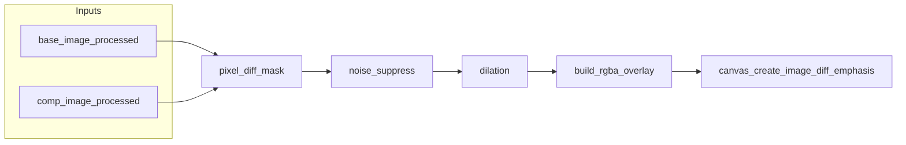

# M6 Plan — メインタブ差分の視覚的強調（半透明オーバーレイ）

## 目的
- メインタブでベース／比較を重ね表示したとき、**小さな差分**を見つけやすくする。
- ベース／比較のカラーパレットによる色分けを活かしつつ、差分領域に**半透明の太い塗りつぶし**を重ねて強調する（ユーザーが ON/OFF できるトグル）。
- **指定色濃淡**および**二色化**など、現行の色処理モード適用後の見た目を前提とし、同一前提で差分マスクを定義する。

## 背景・現状整理
- プレビュー画像の色処理は `apply_color_processing_to_image`（`controllers/pdf_export_handler.py`）で行われる。指定色濃淡はグレースケールに基づき指定色へ濃淡マッピングし、二色化はしきい値以下を指定色・それ以外を透明に近い形で表現する。
- 画面上の「差分」は、スキャン RGB の生データそのものではなく、**処理後の RGBA 同士がどれだけ異なるか**で定義するのが実装上一貫しやすい。
- メインタブは `CreateComparisonFileApp`（`views/main_tab.py`）の `_display_page` で、変形適用後の `base_image` / `comp_image` をキャンバスに重ねている。強調レイヤーはこの座標系・タイミングに乗せる。
- マイルストーン **M5**（`docs/milestone/M5_PLAN.md`）はドキュメント整備用であり、本件とは独立する。

## スコープ
- 対象:
  - `views/main_tab.py`（`_display_page` 周辺、キャンバス上の描画・マウスハンドラとの Z 順）
  - （推奨）差分マスク生成をテストしやすい `utils/` 配下の純関数モジュール
- 非対象（初版）:
  - PDF 操作タブ、画像タブ
  - エクスポート PDF への強調レイヤーの焼き込み（必要なら別タスク）
  - 新規の重いネイティブ依存を必須とする実装（numpy + PIL を既定とする）

## 実装方針

### 1) 差分マスクの定義
- `_display_page` 内で、表示に使うのと同じ **色処理済み・変形済み** の `base_image` / `comp_image`（両方存在する場合）を入力とする。
- 同一サイズに揃える必要がある場合は、現行の描画ロジックに合わせてリサイズ／クロップ規則を文書化し、それに従う。
- numpy で RGBA を比較し、チャネル差の二乗和または最大差などでスカラー差分とし、**しきい値**以上を「差分ピクセル」とする。アルファの差も考慮する。
- アンチエイリアス等によるノイズは、**最小連結成分面積での除去**や、単純な **モフォロジー（収縮・膨張）** で抑制する。

### 2) 「太い」半透明塗り
- 差分マスクを **膨張（dilation）** して帯域を太らせる。半径またはイテレーション回数は初版では固定でもよい（後から設定化可能とする余地を残す）。
- 強調色はベース／比較のパレットと区別しやすい色（例: 黄・マゼンタ系）をデフォルトとし、**アルファ**で半透明を指定する。
- PIL で RGBA オーバーレイ画像を生成し、`canvas.create_image(..., tags=("diff_emphasis",))` で貼り付ける。既存の `pdf_image` / `base_image` / `comp_image` より手前になるよう `tag_raise` で調整する。

### 3) トグルとライフサイクル
- UI に「差分強調」などのトグル（チェックボタンまたはトグルボタン）を追加する。OFF 時は `canvas.delete("diff_emphasis")` 相当でレイヤーを除去する。
- 次のタイミングでマスクを再計算またはキャッシュ無効化する: ページ変更、ベース／比較の表示 ON/OFF、変形データ変更、色処理モード変更、各色・しきい値変更、プレビュー用画像の再読み込み。
- 計算コストが高い場合は、上記パラメータをキーとした**キャッシュ**を検討する。

### 4) 依存関係
- 既定: 既存の **numpy** と **PIL** のみで実装する。
- OpenCV 等を導入する場合は `pyproject.toml` の更新とライセンス・配布サイズの整理をタスクに含める。

## 処理フロー（概要）

## タスク分解

### M6-001: 差分マスク生成ユーティリティ
- [ ] 二枚の RGBA `Image` としきい値等からマスク（boolean または uint8）を返す関数を `utils/` に切り出す。
- [ ] 単体テスト可能な粒度にし、入力サイズ不一致時の扱いを決めて実装または明示的エラーにする。

### M6-002: メインタブへのオーバーレイ統合
- [ ] 「差分強調」トグルを配置し、状態を保持する。
- [ ] `_display_page` の描画完了後（または内部で）トグル ON かつ両レイヤー利用可能なときだけオーバーレイを生成・表示する。
- [ ] ページ・変形・色設定変更時にオーバーレイが正しく更新／削除されることを確認する。

### M6-003: 文言・説明（任意）
- [ ] `configurations/message_codes.json` に UI 文言を追加し、言語切替に対応する。
- [ ] `views/description.py` に本機能の一行説明を追記する（M5 の説明タブ方針と整合させる）。

### M6-004: 検証と調整
- [ ] 指定色濃淡・二色化の両方で、意図的に差を付けたサンプルで強調が期待どおりか確認する。
- [ ] 大きなページでも操作が重くなりすぎないか目安を記録し、必要ならしきい値・膨張・キャッシュを調整する。

## 検証手順
1. メインタブでベース／比較を読み込み、両レイヤーを表示する。
2. 指定色濃淡で軽微な差があるページを表示し、「差分強調」を ON にする。半透明の塗りが差分付近に現れることを確認する。
3. 二色化に切り替え、同様に ON/OFF で表示が切り替わることを確認する。
4. ページ送り・ズーム／パン（該当する場合）・変形適用後に、強調が破綻しないか確認する。
5. トグル OFF で強調レイヤーが消えることを確認する。

## 受け入れ基準
- メインタブのみで、ユーザーが差分強調の ON/OFF を切り替えられる。
- 指定色濃淡および二色化のいずれでも、処理後画像に基づく差分が視覚的に強調される（過剰ノイズは抑制されていることが望ましい）。
- M5 のドキュメント整備計画（`M5_PLAN.md`）の完了を本マイルストーンの前提とはしない。
- 既定実装は numpy + PIL のみとし、新規依存が増える場合は計画本文の「依存関係」に沿って明示される。

## 実装メモ
- プレビュー再描画のたびに全ピクセル処理を走らせると重くなるため、キャッシュキーにページインデックス、変形タプル、色モード、各色・しきい値、トグル状態を含めることを検討する。
- `MouseEventHandler` や `reference_grid` など既存タグとの重なり順を変えないよう、専用タグ `diff_emphasis` でまとめて管理する。
